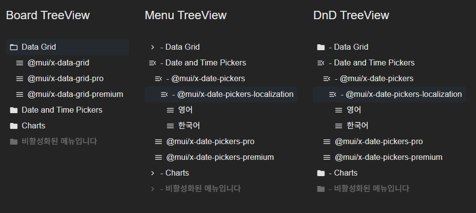

# TreeView Component Library

MUI x-tree-view 기반의 다양한 스타일과 드래그 앤 드롭 기능을 제공하는 TreeView 컴포넌트 라이브러리입니다.

## 🚀 주요 기능

- **3가지 TreeView 스타일**: Board, Menu, DnD 타입 지원
- **Drag & Drop**: React DnD 기반 완전한 드래그 앤 드롭 기능
- **TypeScript 지원**: 완전한 타입 안전성
- **MUI 기반**: Material-UI 디자인 시스템 적용
- **확장 가능한 구조**: 새로운 타입 추가 용이

## 📁 폴더 구조

```
src/
├── App.tsx                     # 메인 애플리케이션
└── TreeView/
    ├── TreeView.tsx            # 메인 통합 TreeView 컴포넌트
    ├── TreeItem.tsx            # TreeItemSelector + TreeViewWrapper
    ├── DndTreeView.tsx         # DnD 전용 컴포넌트
    ├── treeUtils.ts            # 트리 조작 유틸리티 함수
    ├── types.ts                # TypeScript 타입 정의
    ├── treeData.json           # 샘플 트리 데이터
    ├── Board/
    │   └── index.tsx           # Board 스타일 TreeView
    ├── Menu/
    │   └── index.tsx           # Menu 스타일 TreeView
    └── Dnd/
        └── index.tsx           # DnD 기능 TreeView
```

## 🎯 사용법

### 1. 기본 사용법

```tsx
import TreeView from "./TreeView/TreeView";

// Board 스타일 (기본값)
<TreeView type="board" />

// Menu 스타일
<TreeView type="menu" />

// Drag & Drop 기능
<TreeView type="dnd" />
```

### 2. 타입별 상세 기능

#### Board TreeView (`type="board"`)

- 폴더와 파일을 구분하는 아이콘
- 폴더 열림/닫힘 상태 표시
- 계층적 구조 시각화

```tsx
<TreeView type="board" />
```

#### Menu TreeView (`type="menu"`)

- 메뉴 스타일 아이콘
- 간단한 트리 구조 표시
- 최소한의 시각적 요소

```tsx
<TreeView type="menu" />
```

#### DnD TreeView (`type="dnd"`)

- 완전한 드래그 앤 드롭 기능
- 실시간 트리 구조 재배열
- 시각적 드롭 피드백

```tsx
<TreeView type="dnd" />
```

## 🎨 DnD 기능 상세

### 드롭 위치 지정

- **Before**: 노드의 상단 25% 영역에 드롭
- **After**: 노드의 하단 25% 영역에 드롭
- **Inside**: 노드의 중앙 50% 영역에 드롭 (자식으로 추가)

### 시각적 피드백

- 드래그 중: 노드 투명도 변경
- 드롭 가능 영역: 파란색 하이라이트
- 위치별 표시: 상단/하단 선, 배경색 변경

### 지원 기능

- ✅ 자식이 없는 노드도 드롭 타겟 가능
- ✅ 순환 참조 방지
- ✅ 실시간 트리 재구성
- ✅ 타입 안전한 드래그 앤 드롭

## 🔧 데이터 구조

```json
{
  "treeItems": [
    {
      "id": "unique-id",
      "label": "노드 이름",
      "disabled": false,
      "children": [
        {
          "id": "child-id",
          "label": "자식 노드",
          "children": []
        }
      ]
    }
  ]
}
```

### 필수 속성

- `id`: 고유 식별자 (string)
- `label`: 노드 표시 이름 (string)

### 선택 속성

- `disabled`: 비활성화 여부 (boolean)
- `children`: 자식 노드 배열 (TBaseTreeView[])

## 🛠 설치 및 실행

```bash
# 의존성 설치
npm install

# 개발 서버 실행
npm run dev

# 빌드
npm run build
```

## 📦 주요 의존성

- `@mui/material`: Material-UI 컴포넌트
- `@mui/x-tree-view`: MUI TreeView 컴포넌트
- `react-dnd`: 드래그 앤 드롭 라이브러리
- `react-dnd-html5-backend`: HTML5 DnD 백엔드

## 🔗 예시 화면



세 가지 타입의 TreeView를 나란히 비교할 수 있습니다:

- 왼쪽: Board TreeView
- 가운데: Menu TreeView
- 오른쪽: DnD TreeView (드래그 앤 드롭 가능)

## 📝 TypeScript 지원

모든 컴포넌트는 TypeScript로 작성되어 완전한 타입 안전성을 제공합니다:

```tsx
type TreeViewProps = {
  type?: "board" | "menu" | "dnd";
};

type TBaseTreeView = {
  id: string;
  label: string;
  disabled?: boolean;
  children?: TBaseTreeView[];
};
```

## Disabled items

`disabled` 속성을 사용하여 트리 아이템 컴포넌트를 비활성화 할 수 있습니다.
